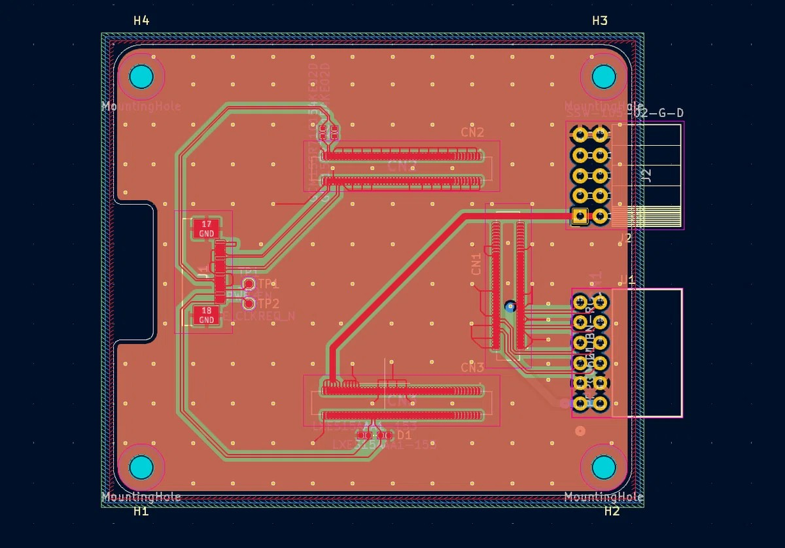
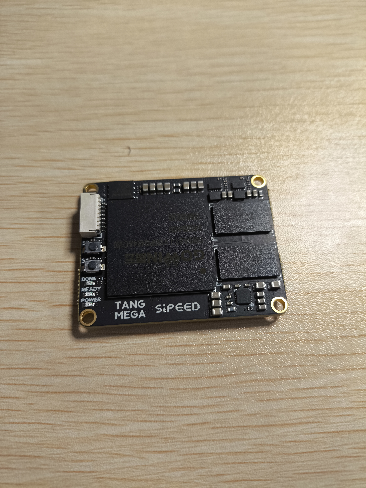
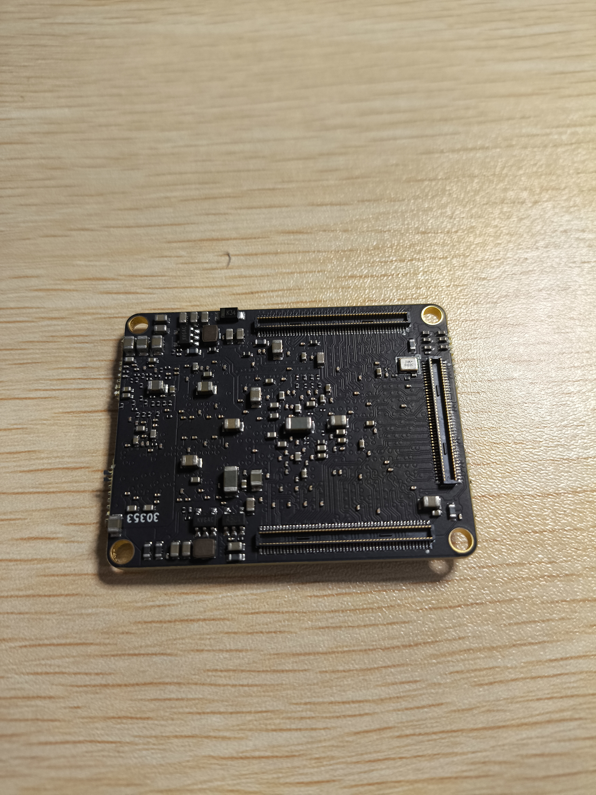

# Demo Board

- Although the tang console has now been released and I no longer plan to use this, I designed a board that can accommodate FPGA sub-boards.
- Designed with KiCAD.
- (There are wiring correction points)  

- Compatible with the Tang 138K SOM board.  

- SOM Back side.  

